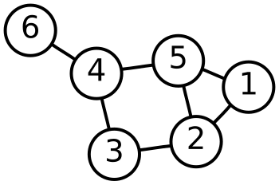
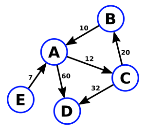
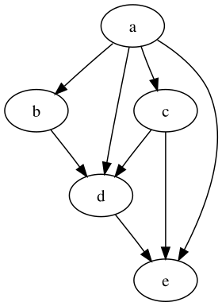

# 📊 Graph Data Structure

## 1️⃣ Definition of Graph

A **graph** is a non-linear data structure that consists of a finite set of **vertices (nodes)** and a set of **edges** connecting pairs of vertices.



**Mathematical Representation:**

$$G = (V, E)$$

Where:
- **V** → Set of vertices
- **E** → Set of edges

Graphs are used to represent **networks, relationships, and connections**.

---

## 2️⃣ Basic Graph Terminology

| Term | Definition |
|------|------------|
| **Vertex (Node)** | A basic unit of a graph that represents an entity |
| **Edge** | A connection between two vertices |
| **Adjacent Vertices** | Two vertices connected by an edge |
| **Degree** | Number of edges connected to a vertex |
| **Path** | A sequence of vertices connected by edges |
| **Simple Path** | A path with no repeated vertices |
| **Cycle** | A path where the first and last vertices are the same |
| **Loop** | An edge that connects a vertex to itself |

---

## 3️⃣ Types of Graphs

### 🔹 Undirected Graph

Edges have **no direction** — connection is bidirectional.


---

### 🔹 Directed Graph (Digraph)

Edges have **direction** — represented using arrows.


---

### 🔹 Weighted Graph

Each edge has a **weight or cost**. Used in shortest path problems.



---

### 🔹 Complete Graph

Every vertex is connected to **every other vertex**.


For n vertices: $\text{Edges} = \frac{n(n-1)}{2}$

---

### 🔹 Cyclic vs Acyclic Graph

| Type | Description |
|------|-------------|
| **Cyclic** | Contains at least one cycle |
| **Acyclic** | Contains no cycles (DAG = Directed Acyclic Graph) |



---

## 4️⃣ Degree Concepts

| Concept | Description |
|---------|-------------|
| **Degree** (Undirected) | Number of edges connected to a vertex |
| **In-Degree** (Directed) | Number of edges coming **into** a vertex |
| **Out-Degree** (Directed) | Number of edges going **out** of a vertex |

---

## 5️⃣ Graph Representation

### 🔹 Adjacency Matrix

A **2D array** of size V × V where:
- `1` → Edge exists
- `0` → No edge

```
   A B C D
A  0 1 1 0
B  1 0 1 1
C  1 1 0 1
D  0 1 1 0
```

**Characteristics:**
- ✅ Fast edge lookup O(1)
- ❌ Uses more memory O(V²)
- 📌 Suitable for **dense graphs**

---

### 🔹 Adjacency List

An **array of linked lists** where each vertex stores a list of its adjacent vertices.

```
A → [B, C]
B → [A, C, D]
C → [A, B, D]
D → [B, C]
```

**Characteristics:**
- ✅ Uses less memory O(V + E)
- ✅ Efficient for **sparse graphs**
- ❌ Edge lookup is slower O(V)

---

## 6️⃣ Comparison: Matrix vs List

| Feature | Adjacency Matrix | Adjacency List |
|---------|------------------|----------------|
| **Memory** | O(V²) - High | O(V + E) - Low |
| **Edge Lookup** | O(1) - Fast | O(V) - Slower |
| **Best For** | Dense graphs | Sparse graphs |
| **Representation** | 2D Array | Linked Lists |

---

## 7️⃣ Graph Traversals

### 🔹 Breadth-First Search (BFS)

Explores neighbors level by level using a **Queue**.


**Applications:** Shortest path (unweighted), level order traversal

---

### 🔹 Depth-First Search (DFS)

Explores as deep as possible before backtracking using a **Stack**.


**Applications:** Cycle detection, topological sort, pathfinding

---

## 8️⃣ Applications of Graphs

| Application | Example |
|-------------|---------|
| 🌐 Computer Networks | Internet, LAN topology |
| 🗺️ Road Maps | GPS navigation, Google Maps |
| 👥 Social Networks | Facebook friends, LinkedIn connections |
| ⚡ Electrical Circuits | Circuit design |
| 📅 Scheduling | Task dependencies, project planning |
| 📡 Communication | Telecom networks |

---

